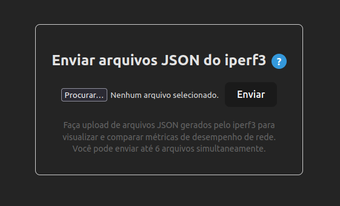
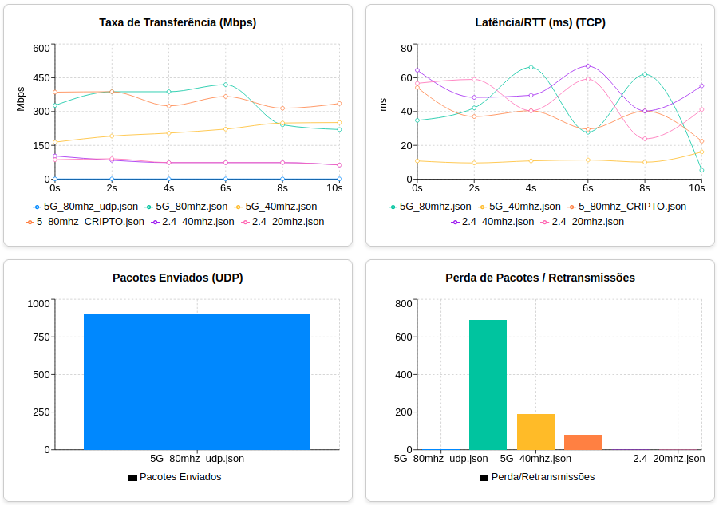
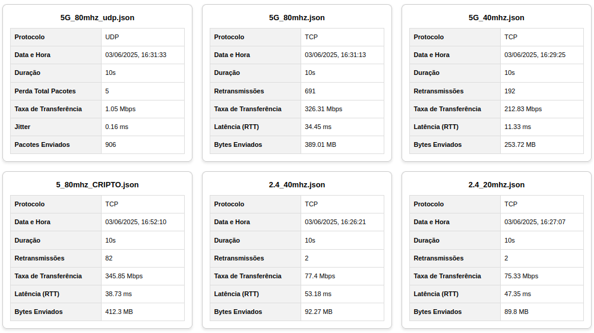

# Gráfico de Resultados do iperf (TCP/UDP)

Este projeto permite o upload de arquivos JSON gerados pelo iperf3 (ferramenta de teste de rede), processa esses arquivos no backend, extrai estatísticas relevantes de testes TCP e UDP, e exibe gráficos comparativos e relatórios detalhados no frontend.

<p align="center">
  
  <br><em>Upload de arquivos</em>
</p>
<p align="center">
  
  <br><em>Visualização dos gráficos</em>
</p>
<p align="center">
  
  <br><em>Relatório detalhado</em>
</p>

---

## Visão Geral

- **Backend (Node.js + Express):** Recebe arquivos JSON, faz o parsing dos dados de testes de rede (TCP/UDP), extrai estatísticas e retorna para o frontend.
- **Frontend (React + Vite):** Permite upload dos arquivos, armazena os resultados no localStorage e exibe gráficos comparativos e relatórios detalhados.

---

## Estrutura do Projeto

```
Dsmp_Iperf/
├── backend/
│   ├── src/
│   │   ├── utils/
│   │   │   ├── fileUtils.ts       # Utilitários para leitura/escrita de JSON
│   │   │   └── iperfParser.ts     # Lógica de parsing dos dados do iperf3
│   │   └── server.ts              # Arquivo principal do servidor Express
│   ├── uploads/                   # Pasta temporária para arquivos enviados (deve ser criada ou gerenciada)
│   ├── package.json
│   └── tsconfig.json
├── frontend/
│   ├── public/
│   ├── src/
│   │   ├── components/
│   │   │   ├── FileUpload.tsx     # Componente para upload de arquivos
│   │   │   ├── Graficos.css       # CSS para o componente de gráficos
│   │   │   └── Graficos.tsx       # Componente para exibir gráficos e tabelas
│   │   ├── App.css
│   │   ├── App.tsx                # Componente principal da aplicação React com rotas
│   │   ├── index.css
│   │   └── main.tsx               # Ponto de entrada da aplicação React
│   ├── index.html
│   ├── package.json
│   └── tsconfig.json
├── testes/                        # Pasta com exemplos de arquivos JSON do iperf3
│   ├── 2.4_20mhz.json
│   ├── 2.4_40mhz.json
│   ├── 5G_40mhz.json
│   ├── 5G_80mhz.json
│   ├── 5_80mhz_CRIPTO.json
│   └── 5G_80mhz_udp.json
└── README.md                      # Este arquivo
```
## Detalhes da Implementação

*   **Backend (`server.ts`):**
    *   Utiliza `multer` para lidar com o upload de arquivos, salvando-os temporariamente na pasta `uploads/`.
    *   Para cada arquivo, `fileUtils.ts` (`readJsonFile`) lê o conteúdo.
    *   `iperfParser.ts` (`parseIperf`) processa o JSON bruto, extraindo informações relevantes do sumário (`end` section) e dos intervalos (`intervals` section) para TCP e UDP.
    *   Os dados processados de todos os arquivos são enviados de volta ao frontend.
    *   Os arquivos temporários são excluídos após o processamento.
*   **Frontend (`Graficos.tsx`):**
    *   Recebe os dados processados do backend (via `localStorage` após o upload em `FileUpload.tsx`).
    *   Renderiza condicionalmente os gráficos com base nos dados disponíveis e no protocolo (TCP/UDP).
    *   A função `renderInPairsWithPlaceholders` organiza os gráficos em pares, adicionando um placeholder se houver um número ímpar de gráficos visíveis.


## Pré-requisitos

*   **Node.js:** Versão 16.x ou superior (inclui npm).
*   **npm** (ou **yarn**): Gerenciador de pacotes do Node.js.
*   **iperf3:** Para gerar os arquivos JSON de teste de desempenho. Você pode instalá-lo no seu sistema operacional (ex: `sudo apt install iperf3` no Ubuntu).

## Configuração e Execução

Siga os passos abaixo para configurar e rodar o projeto localmente:

**1. Clonar o Repositório:**
   ```bash
   git clone https://github.com/PEDRO-Lz/Desempenho_de_Rede.git
   cd Dsmp_Iperf
   ```

**2. Configurar o Backend:**
   ```bash
   cd backend
   npm install
  npx ts-node-dev server.ts
   ```
   O backend estará rodando em `http://localhost:3001`. Certifique-se que a pasta `backend/uploads/` exista ou que o `multer` tenha permissão para criá-la, caso contrário, crie-a manualmente.

**3. Configurar o Frontend:**  
  Em outro terminal
   ```bash
   cd frontend
   npm install
   npm run dev
   ```
   O frontend estará acessível em `http://localhost:5173` (ou outra porta que o Vite designar).

**4. Acessar a Aplicação:**
   Abra seu navegador e acesse `http://localhost:5173`.

## Como Usar a Aplicação

**1. Gerar Arquivos de Teste com iperf3:**
   Para gerar os arquivos JSON que a aplicação consome, você precisará executar testes com o iperf3 usando a flag `-J` ou `--json`.

   Exemplo de comando iperf3 (cliente enviando para um servidor):
   ```bash
   # No servidor iperf3:
   iperf3 -s

   # No cliente iperf3 (substitua <ip-do-servidor> pelo IP real):
   iperf3 -c <ip-do-servidor> -t 10 -J > nome_do_teste.json
   ```
   *   `-c <ip-do-servidor>`: Especifica o modo cliente e o IP do servidor.
   *   `-t 10`: Define a duração do teste para 10 segundos.
   *   `-J`: Gera a saída no formato JSON.
   *   `> nome_do_teste.json`: Redireciona a saída JSON para um arquivo.

   Para testes UDP:
   ```bash
   iperf3 -c <ip-do-servidor> -u -b 10M -t 10 -J > nome_do_teste_udp.json
   ```
   *   `-u`: Modo UDP.
   *   `-b 10M`: Taxa de bits alvo de 10 Mbps (ajuste conforme necessário).

   Consulte a documentação do `iperf3 --help` para mais opções.

**2. Testar a Aplicação com Arquivos de Exemplo:**
   *   Este projeto inclui uma pasta `testes/` com arquivos JSON de exemplo.
   *   Na página inicial da aplicação, clique para escolher arquivos e selecione de 1 a 6 arquivos da pasta `testes/` (ou os seus próprios).
   *   Clique em "Enviar".
